# YOLOv8 模型剪枝

## 相关原理

该修剪方法的灵感来源于以下研究论文：

- **[Learning Efficient Convolutional Networks Through Network Slimming](https://arxiv.org/abs/1708.06519)**
- **[Pruning Filters for Efficient ConvNets](https://arxiv.org/abs/1608.08710)**

------

## 剪枝方法

基于BN层系数gamma剪枝。

在一个卷积-BN-激活模块中，BN层可以实现通道的缩放。如下：

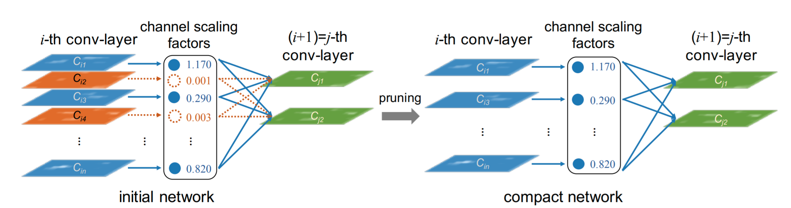

### BN层操作

BN层的具体操作有两部分：

1. **归一化** 

2. **线性变换** 

   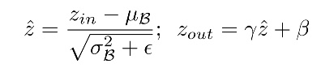

当系数gamma很小时候，对应的激活（Zout）会相应很小。这些响应很小的输出可以裁剪掉，这样就实现了bn层的通道剪枝（剪枝的本质是看每个通道的重要性，这只是判断通道重要性的一个方法）。

通过在loss函数中添加gamma的L1正则约束，可以实现gamma的稀疏化。

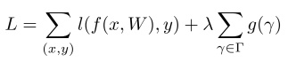

上面损失函数L右边第一项是原始的损失函数，第二项是约束，其中g(s) = |s|，λ是正则系数，根据数据集调整，实际训练的时候，就是在优化L最小，依据梯度下降算法：

𝐿′=∑𝑙′+𝜆∑𝑔′(𝛾)=∑𝑙′+𝜆∑|𝛾|′=∑𝑙′+𝜆∑𝛾∗𝑠𝑖𝑔𝑛(𝛾)

所以只需要在BP传播时候，在BN层权重乘以权重的符号函数输出和系数即可，对应添加如下代码:

```
# ===================== Sparsity Training =========================
if self.sr is not None:
    srtmp = self.sr * (1 - 0.9 * self.epoch / self.epochs)  # L1 regularization coefficient with linear decay
    ignore_bn_list = []
    for k, m in self.model.named_modules():
        if isinstance(m, Bottleneck):
            if m.add:  # Skip pruning for Bottleneck modules with shortcuts
                ignore_bn_list.append(k.rsplit(".", 2)[0] + ".cv1.bn")  # First Conv-BN layer in C2f
                ignore_bn_list.append(k + '.cv2.bn')  # Second Conv-BN layer in C2f
        if isinstance(m, nn.BatchNorm2d) and (k not in ignore_bn_list):
            m.weight.grad.data.add_(srtmp * torch.sign(m.weight.data))  # L1
# ==================================================================
```

这里并未对所有BN层gamma进行约束，对C3结构中的Bottleneck结构中有shortcut的层不进行剪枝，主要是为了保持tensor维度可以加：

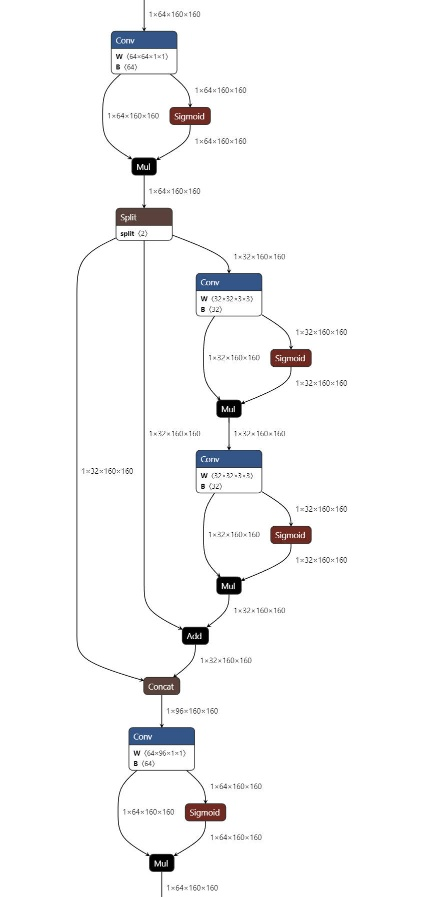

------

## 使用指南

### 总览

此库包含以下模块:

- 官方 YOLOv8 代码库
- 自定义脚本: `train.py`, `train_sparsity.py`, `prune.py`, `finetune.py`, 和 `val.py`.

因为数据集使用的是[NWPU](https://www.kaggle.com/datasets/huynhphucthinhne/nwpu-vhr-10-yolo)，不在官方cfg中，所以要自己写一个`.yaml`文件，放在`ultralytics/cfg/datasets`中。

------

### 1. 常规训练

运行 `train-normal.py` 进行常规训练:

```
from ultralytics import YOLO

model = YOLO("weights/yolov8m.pt")  # Pretrained weights
# Set L1 regularization coefficient to 0
model.train(
    sr=0, 
    data="ultralytics/cfg/datasets/NWPU.yaml",  # Dataset configuration
    epochs=150, 
    project='.', 
    name='runs/train-normal', 
    batch=24, 
    device=0
)

```

#### 注意:

1. 将预训练权重放置在 `weights` 文件夹中。
2. 配置数据集 YAML 文件（请参考 YOLOv8 官方仓库中的 `coco128.yaml`）。
3. 设置 `sr=0` 以在标准训练期间禁用 L1 正则化。

------

### 2. 稀疏训练

运行 `train_sparsity.py` 进行稀疏训练:

```
from ultralytics import YOLO

model = YOLO("runs/train-normal/weights/best.pt")  # Load the best model from normal training
# Set L1 regularization coefficient
model.train(
    sr=1e-2, 
    lr0=1e-3,
    data="ultralytics/cfg/datasets/NWPU.yaml", 
    epochs=50, 
    patience=50, 
    project='.', 
    name='runs/train-sparsity', 
    batch=24, 
    device=0
)
```

#### 注意:

1. 设置一个非零的 `sr` 值以强制稀疏性。更大的 `sr` 值会增强剪枝强度。

2. 使用 `vis-bn-weight.py` 可视化稀疏训练前后gamma分布的情况。
**常规训练**
   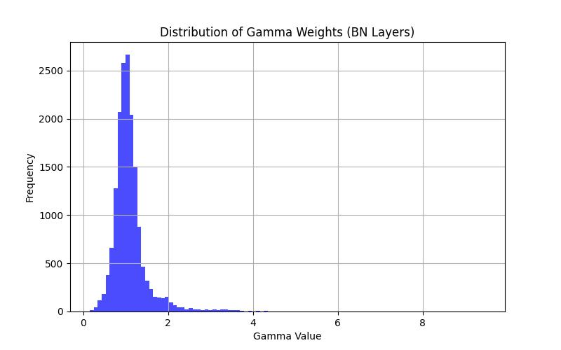
   
**稀疏训练**
   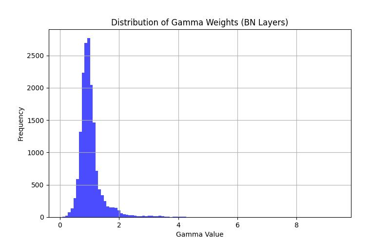

------

### 3. 剪枝

运行 `prune.py` 对模型剪枝:

```
def parse_opt():
    parser = argparse.ArgumentParser()
    parser.add_argument('--data', type=str, default=ROOT / 'ultralytics/cfg/datasets/NWPU.yaml', help='Dataset YAML path')
    parser.add_argument('--weights', nargs='+', type=str, default=ROOT / 'runs/train-sparsity/weights/last.pt', help='Model weights path')
    parser.add_argument('--cfg', type=str, default=ROOT / 'ultralytics/cfg/models/v8/yolov8.yaml', help='Model configuration path')
    parser.add_argument('--model-size', type=str, default='s', help='YOLOv8 model size (e.g., s, m, l, x)')
    parser.add_argument('--prune-ratio', type=float, default=0.5, help='Prune ratio')
    parser.add_argument('--save-dir', type=str, default=ROOT / 'weights', help='Directory to save pruned model weights')
    opt = parser.parse_args()
    return opt

```

#### 需要调整的参数:

- `--data` 和 `--weights`：数据集和已训练权重的路径。
- `--prune-ratio`：要剪枝的通道比例。
- `--save-dir`：保存剪枝后模型（`prune.pt`）的目录。

------

### 4. 微调

运行 `finetune.py` 微调剪枝后的模型:

```
from ultralytics import YOLO

model = YOLO("weights/pruned.pt")  # Load pruned model
# Enable fine-tuning
model.train(data="ultralytics/cfg/datasets/NWPU.yaml", epochs=200, finetune=True)

```

------

## 结果

在NWPU数据集上运行 YOLOv8m 模型:

| **Prune Ratio** | **Parameters** | **GFLOPs** | **mAP50** | **Inference Speed** |
| --------------- | -------------- | ---------- | --------- | ------------------- |
| 50%             | 9.5M           | 12.1       | 0.894     | 3.9ms               |
| 0%              | 25.9M          | 39.7       | 0.951     | 4.2ms               |

**模型剪枝前的PR曲线**
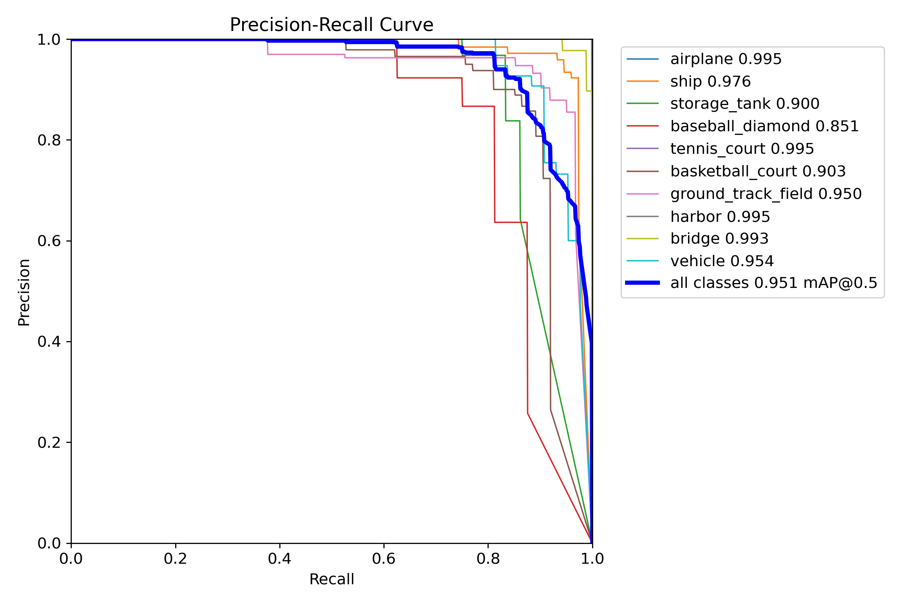
**模型剪枝后的PR曲线**
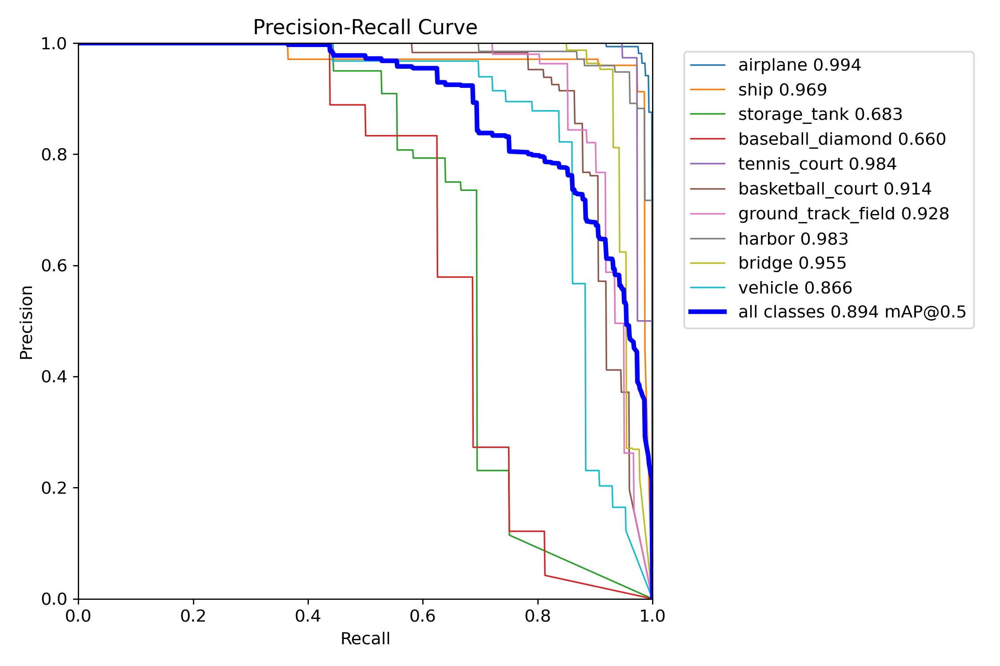

------

**模型剪枝前的混淆矩阵**
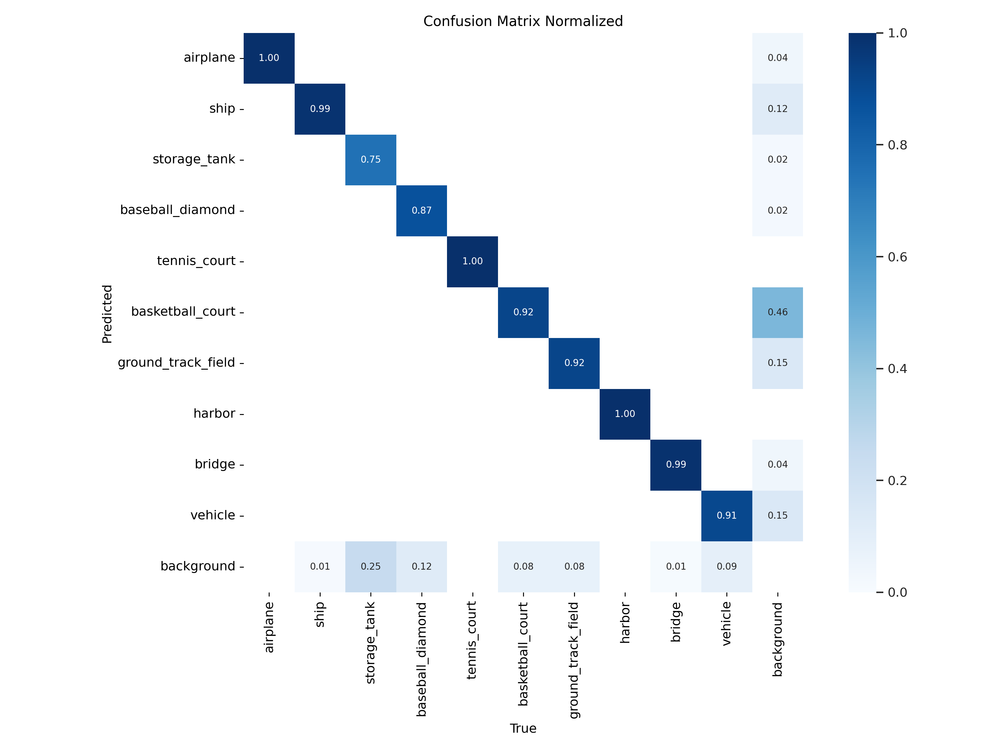
**模型剪枝后的混淆矩阵**
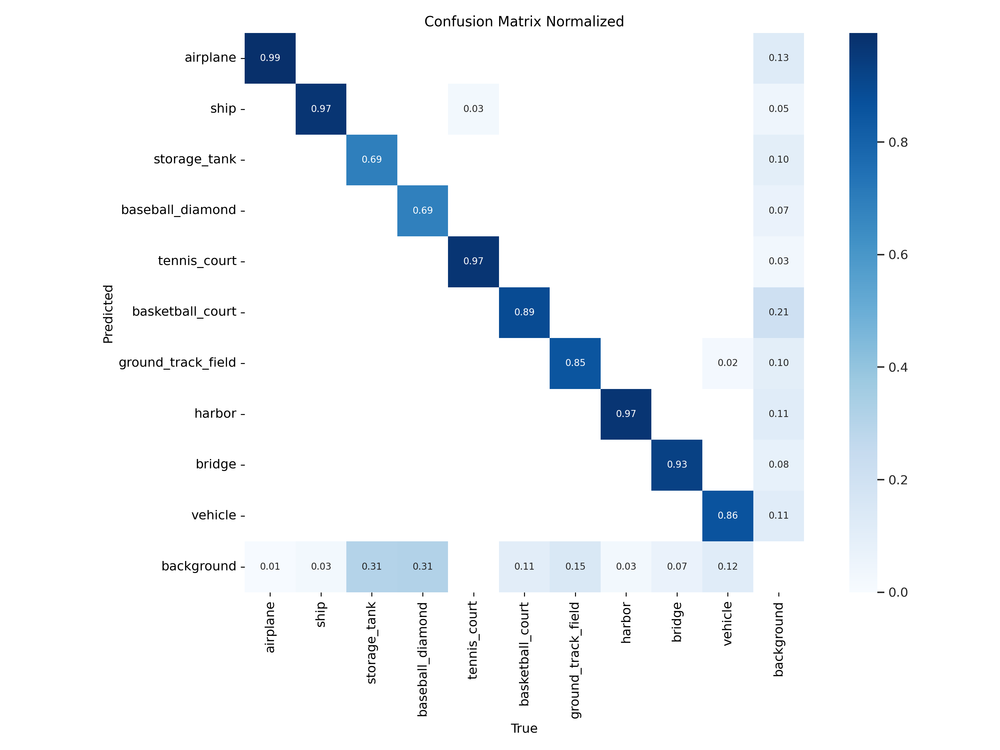

------

### 模型剪枝前后目标检测对比
***图1***
**原始模型**
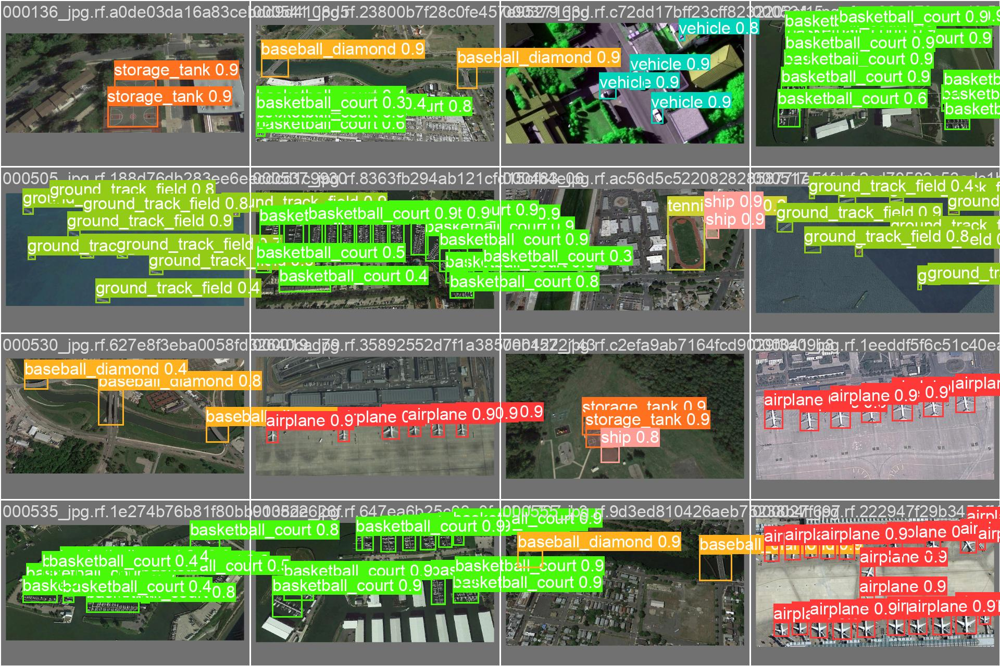
**蒸馏模型**
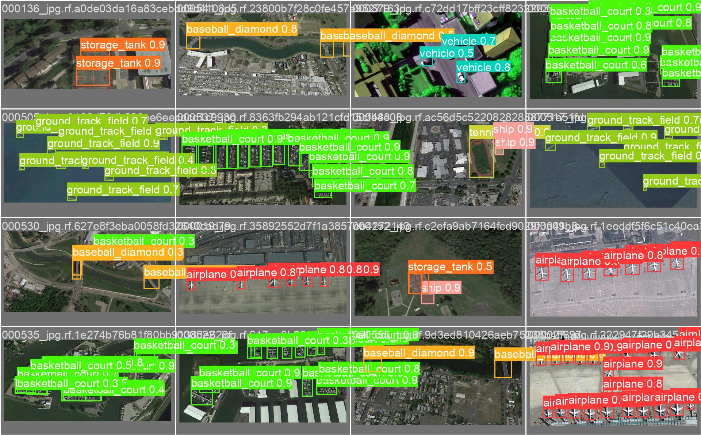

------

***图2***
**原始模型**
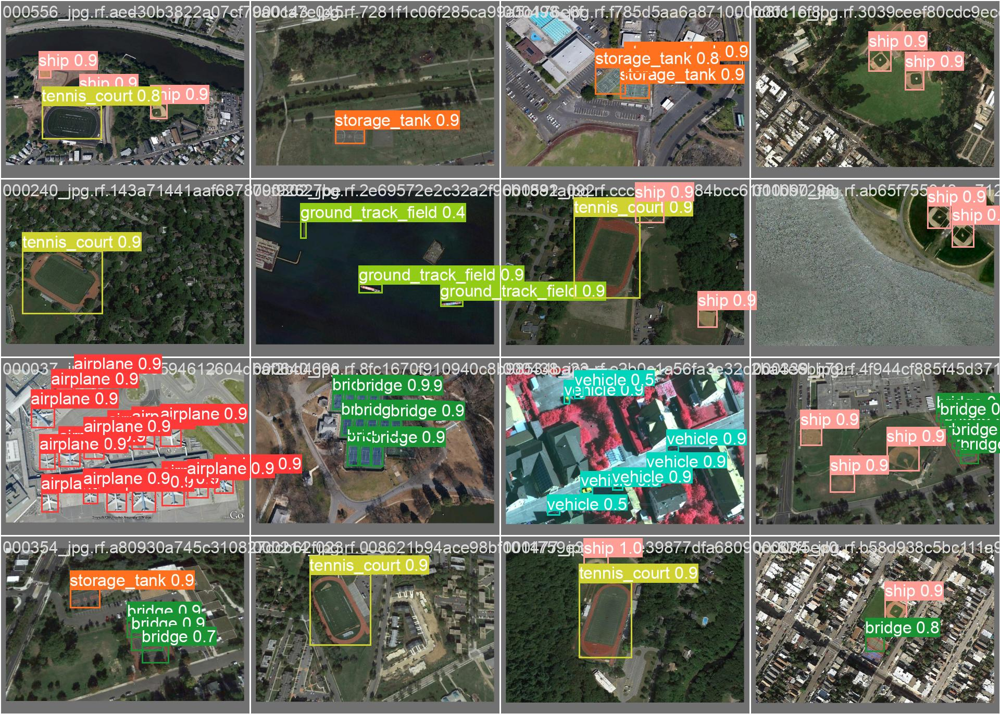
**蒸馏模型**
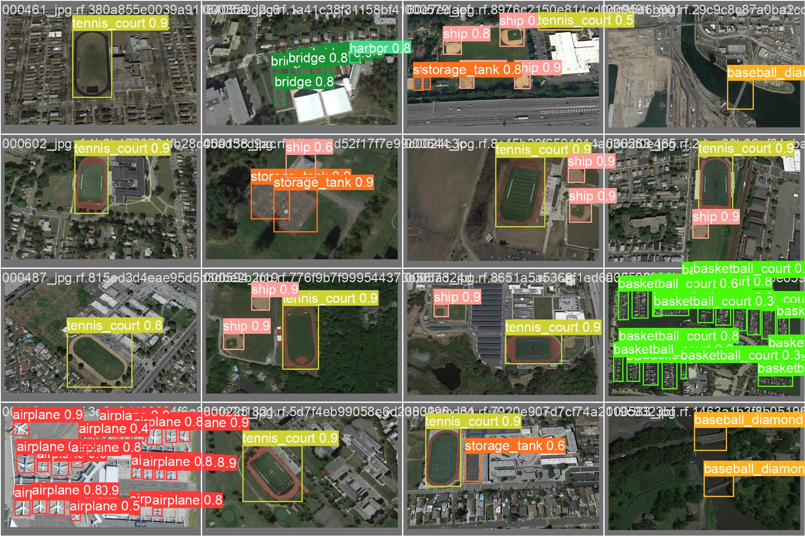

------

***图3***
**原始模型**
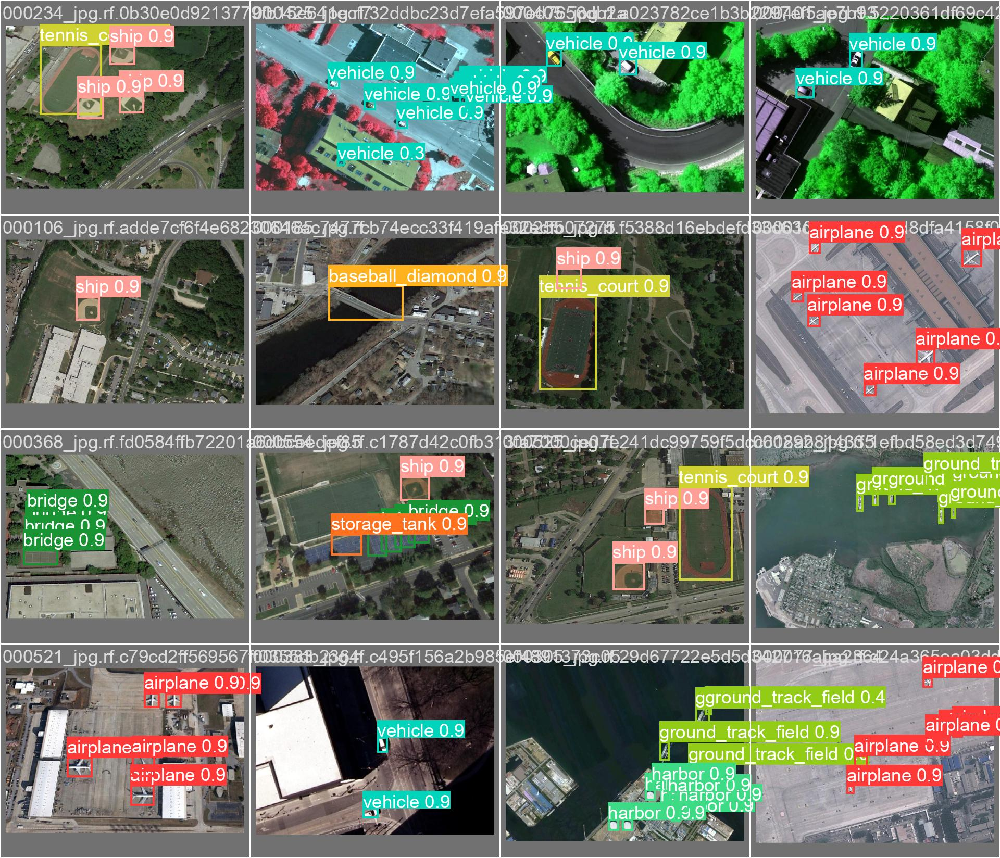
**蒸馏模型**
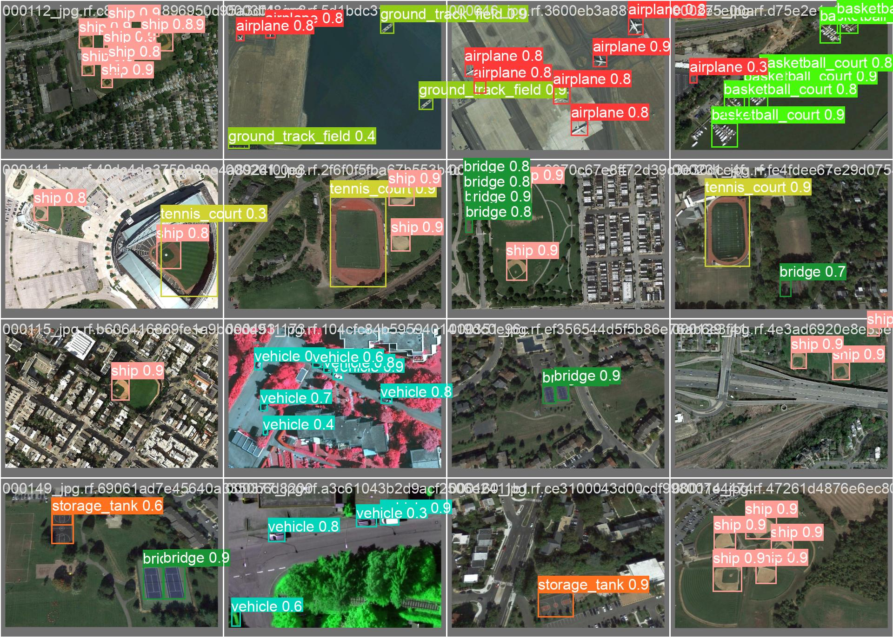

------

## 注意

在稀疏训练期间禁用 **AMP**、**scaler** 和 **grad_clip_norm**。


Reference: [YOLOv5 Prune](https://github.com/midasklr/yolov5prune)  [YOLOv8s Prune](https://github.com/JasonSloan/yolov8-prune)
